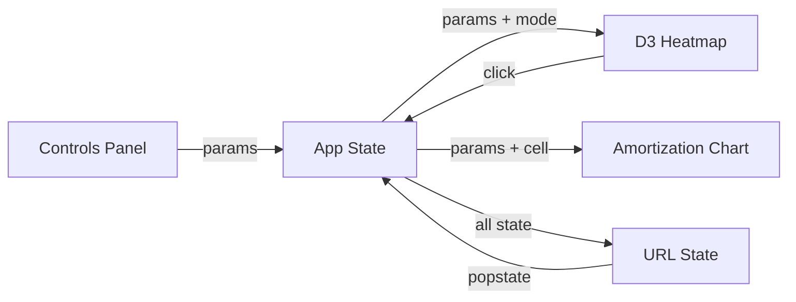

# Mortgage Viz

An interactive heatmap for evaluating monthly mortgage payments across home price and property tax — built entirely through AI-native development with Claude.

 

## The Story

Years ago — first-time home buyer, no idea what I was doing — I built a MATLAB tool to brute-force the question every buyer wrestles with: *what does this actually cost me per month?* Not the Zillow estimate, not the lender's optimistic napkin math. The real number, with tax and insurance and PMI and HOA all baked in, across a grid of prices and tax amounts so I could see the full landscape at once.

That tool worked. Helped me buy a house. Then it sat on a hard drive and collected dust.

This is that tool rebuilt from scratch — React, D3, dark finance theme — as an exercise in AI-native design. Every line of code, every component, every CSS variable was written in collaboration with Claude. The original took a weekend of MATLAB wrangling. This one took a conversation.

**[Try it live →](https://aes87.github.io/mortgage-viz/)**

## What It Does

- **Payment heatmap** — 30×30 grid mapping home price (x) against annual property tax (y), color-coded by total monthly payment
- **Rent boundary line** — shows exactly where buying costs more than your current rent
- **Amortization schedule** — click any cell to see the full payoff curve with equity, balance, and total interest over the loan term
- **Affordability overlay** — DTI-based color bands showing comfortable, stretching, maximum, and over-limit zones relative to your income
- **Scenario comparison** — "What if?" tab overlays a second rent boundary with different rate/term/down payment, filled zone between the two lines
- **Shareable URLs** — every parameter encodes into the URL, so you can send someone your exact view

## Quick Start

```bash
git clone https://github.com/aes87/mortgage-viz.git
cd mortgage-viz
npm install
npm run dev
```

Open `http://localhost:5173/mortgage-viz/` — the heatmap renders immediately with sensible defaults.

## How It Works



The controls panel feeds loan parameters into React state. D3 renders a `scaleBand` grid with a custom color interpolation — navy through teal to gold. The rent boundary is computed by solving for the home price where `totalMonthly == currentRent` at each tax level, then drawing a `d3.line` with monotone interpolation.

Tabs are overlay modes — they modify the heatmap's behavior (affordability tints cells, compare adds a second boundary line) rather than replacing it. Click-to-pin lets you mark up to 5 cells for side-by-side reference.

## Project Structure

```
src/
├── App.jsx                 # Root component, state, tab routing
├── components/
│   ├── Heatmap.jsx         # D3 heatmap + overlays + touch support
│   ├── Controls.jsx        # Sidebar parameter inputs
│   ├── AmortizationChart.jsx
│   ├── AffordabilityControls.jsx
│   ├── TabBar.jsx
│   ├── SummaryStats.jsx
│   └── ExportButton.jsx    # SVG → Canvas → PNG export
├── utils/
│   ├── mortgage.js         # Pure calculation functions
│   └── urlState.js         # URL encode/decode
└── styles/
    └── index.css           # Dark finance theme (CSS custom properties)
```

## The AI-Native Angle

This project is a proof of concept for a workflow — not a framework, not a library, a way of working. The entire codebase was built through iterative conversation with Claude:

- **Architecture decisions** — component boundaries, state management patterns, what goes in utils vs. components
- **D3 integration** — the fiddly bits of making D3's imperative rendering play nice with React's declarative model
- **Visual design** — palette selection, typography hierarchy, the shift from "neon gamer" to "professional finance tool"
- **Review and revision** — three parallel agents reviewed aesthetics, usability, and utility, then their feedback was synthesized into a second pass

The MATLAB original was a single-purpose grid calculator. This version has five interactive modes, touch support, URL persistence, PNG export, and a coherent design language. The delta isn't about AI being faster — it's about AI being a viable design partner for the full stack, from calculation logic to color theory.

## Configuration

All parameters are adjustable in the sidebar:

| Parameter | Range | Default |
|:----------|:------|:--------|
| Interest rate | 1–12% | 6.50% |
| Loan term | 15 or 30 yr | 30 yr |
| Down payment | 0–50% | 20% |
| Insurance rate | 0–2% | 0.50% |
| Monthly HOA | $0–800 | $0 |
| Current rent | $500–8,000 | $2,500 |

Axis ranges (price and tax) are also configurable — useful for zooming into a specific market.

## Tech Stack

React 19 · Vite · D3.js · CSS custom properties · GitHub Pages

## License

MIT
